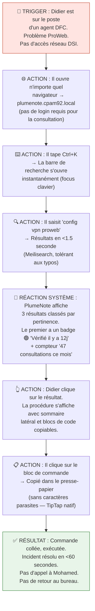
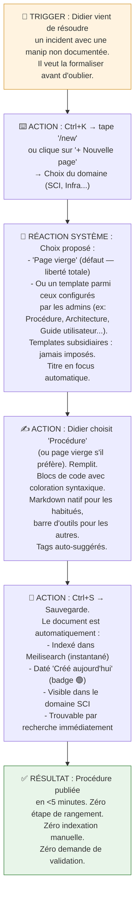
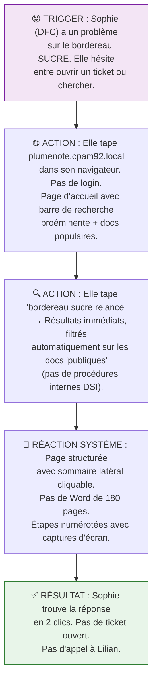
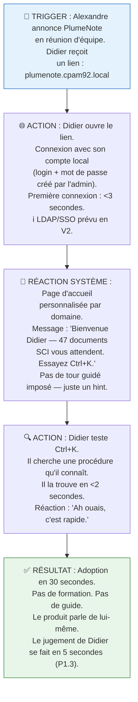
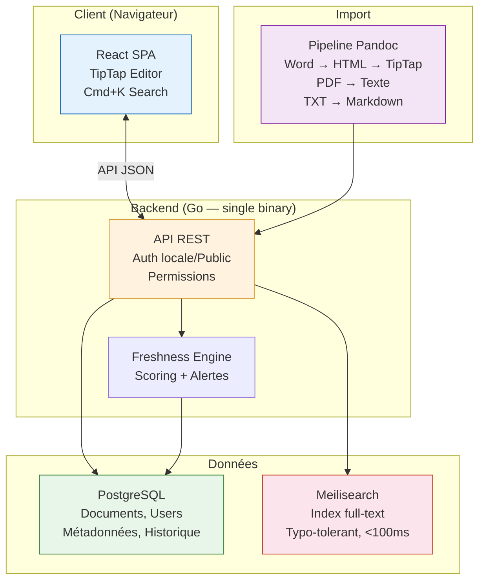
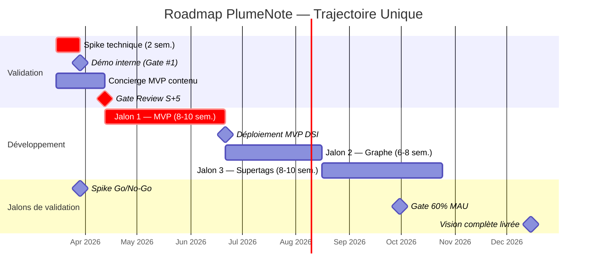

━━━━━━━━━━━━━━━━━━━━━━━━━━━━━━━━━━━━━━━━━━━━━━━
🎨 CONCEPT PRODUIT & MVP SCOPE
Solution : PlumeNote — Vision Séquencée (#23) ·
Trajectoire unique Confiance : 88% | Basé sur : P0 → P3.3 + validation sponsor ━━━━━━━━━━━━━━━━━━━━━━━━━━━━━━━━━━━━━━━━━━━━━━━

---

## 1. Le Pitch Concept (Value Prop)

- **Pour** : Didier — le technicien référent DSI (SCI, Infra, Support). Secondairement : Alexandre (management, vision transversale) et Sophie (MOA/DFC, consultation autonome).
- **Qui veut** : Trouver la bonne procédure en moins de 10 secondes depuis n'importe quel poste — y compris en intervention sur le poste d'un agent — avec la certitude que c'est la version à jour.
- **Notre produit est** : Un "Google interne de la DSI" — une plateforme web self-hosted de Knowledge Management qui unifie toute la documentation technique dans un point d'entrée unique, rapide et visuel.
- **Qui permet de** : Rendre la documentation plus rapide à consulter que le collègue d'à côté (<10 secondes recherche → consultation), accessible depuis n'importe quel navigateur, avec une fraîcheur visible et garantie.
- **La "Secret Sauce"** : Les **signaux de fraîcheur natifs**. C'est le white space identifié en P3.2 : aucun outil du marché (BookStack, Docmost, Outline, XWiki) n'affiche la fiabilité temporelle d'un document. PlumeNote est le seul outil où Didier sait _en un coup d'œil_ s'il peut faire confiance à ce qu'il lit. Badge vert "vérifié il y a 12 jours", badge orange "pas revu depuis 4 mois", badge rouge "obsolescence probable". C'est la fonctionnalité qui casse le cercle vicieux de non-consultation identifié en P1.1.

---

## 2. Parcours Utilisateur (User Flows)

### 🌊 Flow Principal : "Didier en intervention" (Le Happy Path)

_Le scénario idéal — celui qui justifie tout le projet._



**Temps total : <60 secondes** (vs. 20+ minutes aujourd'hui — P1.3) **Interactions** : 4 clics/frappes (Ctrl+K → saisie → clic résultat → clic copier) **Feedback UX critique** : Le badge de fraîcheur est le moment de vérité — c'est là que Didier décide de faire confiance ou non.

---

### 🌊 Flow Secondaire : "Didier contribue" (Le coût de contribution)

_P1.4 Pattern #1 : "Le KM meurt par le coût de contribution." Ce flow doit coûter <5 minutes (P2.3)._



**Temps total cible : <5 minutes** pour une procédure simple (P2.3, IN SCOPE #4) **Interaction clé** : Le choix template/page vierge. Les templates sont un accélérateur, pas une contrainte. Les tags auto-suggérés éliminent le rangement manuel. **Décision de conception** : Pas de workflow de validation au MVP. La publication est immédiate. La confiance repose sur l'identité de l'auteur (les techniciens se connaissent) et le badge de fraîcheur. Un circuit de validation est du scope V1.0.

---

### 🌊 Flow Tertiaire : "Sophie cherche de l'aide" (L'accès MOA)



**Décision de conception** : L'accès public (sans login) est un **Must Have** (P1.3, P2.3). Les contenus publics (documentation applicative MOA) et les contenus internes (procédures DSI) sont séparés par un système de permissions simple : public / DSI / domaine.

---

### 🚧 Flow d'Onboarding : "Premier lancement DSI"



**Décision de conception** : Zéro onboarding forcé. Un seul hint contextuel ("Essayez Ctrl+K"). P1.4 Insight #6 : "les techniciens jugent en 5 secondes." Si le produit nécessite une formation, il a échoué.

---

## 3. Wireframes Conceptuels (Low-Fi)

### Vue 1 : Page d'Accueil / Dashboard (Écran principal)

```text
┌──────────────────────────────────────────────────────────────────┐
│  🪶 PlumeNote                    [Ctrl+K Rechercher...]   [D.B]  │
├──────────────────────────────────────────────────────────────────┤
│                                                                  │
│   Bonjour Didier — 47 documents SCI · 3 mis à jour cette semaine │
│                                                                  │
│   ┌──────────────────────────────────────────────────────────┐   │
│   │  🔍  Tapez votre recherche ou Ctrl+K...                  │   │
│   │      Ex: "config vpn proweb" · "script migration W11"   │   │
│   └──────────────────────────────────────────────────────────┘   │
│                                                                  │
│   📊 ACTIVITÉ RÉCENTE                                            │
│   ┌────────────────────────┐  ┌────────────────────────┐        │
│   │ 🟢 Install ProWeb v4.2 │  │ 🟡 Déploiement Linux   │        │
│   │    SCI · Modifié 2j    │  │    INFRA · Revu 3 mois │        │
│   │    ★ 47 vues ce mois   │  │    ★ 12 vues ce mois   │        │
│   └────────────────────────┘  └────────────────────────┘        │
│   ┌────────────────────────┐  ┌────────────────────────┐        │
│   │ 🟢 Ticket N2 réseau    │  │ 🔴 Script migration W11│        │
│   │    SUPPORT · Revu 1 sem│  │    INFRA · Revu 7 mois │        │
│   │    ★ 29 vues ce mois   │  │    ⚠️ Revue nécessaire │        │
│   └────────────────────────┘  └────────────────────────┘        │
│                                                                  │
│   📁 DOMAINES                                                    │
│   [■ SCI: 47]  [■ Études: 63]  [■ Infra: 38]  [■ Support: 29]  │
│                                                                  │
├──────────────────────────────────────────────────────────────────┤
│  PlumeNote v0.1 · 192 documents · Dernière synchro: il y a 2min │
└──────────────────────────────────────────────────────────────────┘
```

_Légende / Interactions clés :_

- **Barre de recherche** : Focus au chargement. Recherche live dès le 2ème caractère (Meilisearch, tolérant aux typos). Aussi accessible via `Ctrl+K` depuis n'importe quelle page.
- **Badges de fraîcheur** : 🟢 Vérifié <1 mois · 🟡 Vérifié 1-6 mois · 🔴 Pas revu >6 mois. C'est la _Secret Sauce_ — visible partout, tout le temps.
- **Compteur de vues** : Reconnaissance silencieuse des contributeurs (P1.3, besoin latent Didier).
- **Domaines** : Filtrage rapide par service. Clic = liste des documents du domaine.
- **[D.B]** : Initiales de l'utilisateur connecté → menu contextuel (profil, mes contributions, déconnexion).

---

### Vue 2 : Recherche (Le cœur du produit)

```text
┌──────────────────────────────────────────────────────────────────┐
│  🪶 PlumeNote                    [Ctrl+K Rechercher...]   [D.B]  │
├──────────────────────────────────────────────────────────────────┤
│                                                                  │
│   ┌──────────────────────────────────────────────────────────┐   │
│   │  🔍  config vpn proweb                              [×]  │   │
│   └──────────────────────────────────────────────────────────┘   │
│   3 résultats en 0.8s · Filtres: [Tous ▾] [Tous domaines ▾]     │
│                                                                  │
│   ┌──────────────────────────────────────────────────────────┐   │
│   │  📄 Configuration VPN ProWeb — Accès distant             │   │
│   │  🟢 Vérifié il y a 12 jours · SCI · Didier Bottaz       │   │
│   │  "...ouvrir le client VPN, saisir les paramètres de      │   │
│   │  **configuration** : serveur **vpn**.cpam92.fr, port..."  │   │
│   │  ★ 47 vues · 📎 2 fichiers joints                       │   │
│   └──────────────────────────────────────────────────────────┘   │
│                                                                  │
│   ┌──────────────────────────────────────────────────────────┐   │
│   │  📄 Procédure VPN — Dépannage connexion ProWeb           │   │
│   │  🟡 Vérifié il y a 3 mois · SUPPORT · Kevin Brisson     │   │
│   │  "...si la **config** VPN ne fonctionne pas, vérifier    │   │
│   │  les paramètres proxy et le certificat **ProWeb**..."     │   │
│   │  ★ 12 vues                                               │   │
│   └──────────────────────────────────────────────────────────┘   │
│                                                                  │
│   ┌──────────────────────────────────────────────────────────┐   │
│   │  📄 Architecture réseau — VPN et accès externes          │   │
│   │  🔴 Pas revu depuis 8 mois · INFRA · Mohamed Zemouche   │   │
│   │  "...le tunnel **VPN** IPSec est **config**uré sur..."    │   │
│   │  ★ 5 vues                                                │   │
│   └──────────────────────────────────────────────────────────┘   │
│                                                                  │
├──────────────────────────────────────────────────────────────────┤
│  ↑↓ Naviguer · ↵ Ouvrir · Esc Fermer                            │
└──────────────────────────────────────────────────────────────────┘
```

_Légende / Interactions clés :_

- **Highlighting** : Les mots-clés recherchés sont surlignés dans l'extrait (Meilisearch natif). Effet "Google-like" — l'utilisateur voit immédiatement la pertinence.
- **Navigation clavier** : ↑↓ pour naviguer entre résultats, ↵ pour ouvrir, Esc pour fermer. Keyboard-first (P0, UX Linear-inspired).
- **Filtres** : Par type de document (procédure, architecture, guide) et par domaine. Discrets mais accessibles.
- **Temps de réponse** : <1.5s affiché. C'est la promesse visible — si ça dépasse 3s, on a perdu (P1.4 Insight #1).

---

### Vue 3 : Lecture d'une procédure (Le moment de vérité)

```text
┌──────────────────────────────────────────────────────────────────┐
│  🪶 PlumeNote    [Ctrl+K]    SCI > VPN > Configuration    [D.B]  │
├──────────────┬───────────────────────────────────────────────────┤
│              │                                                   │
│  SOMMAIRE    │  Configuration VPN ProWeb — Accès distant         │
│              │  ─────────────────────────────────────────────    │
│  1. Prérequis│  🟢 Vérifié par D. Bottaz · 12 mars 2026         │
│  2. Config   │  SCI · ★ 47 vues · 📝 Dernière modif: 1 mars    │
│  3. Test     │                                                   │
│  4. Dépannage│  ## 1. Prérequis                                  │
│              │                                                   │
│              │  Vérifier que le client VPN Cisco est installé     │
│              │  (version ≥ 4.10). Voir: [Installation VPN →]     │
│              │                                                   │
│              │  ## 2. Configuration                               │
│              │                                                   │
│              │  Ouvrir le client VPN et saisir :                  │
│              │  ┌─────────────────────────────────────────────┐  │
│              │  │ Serveur : vpn.cpam92.fr              [📋]  │  │
│              │  │ Port    : 443                         [📋]  │  │
│              │  │ Groupe  : DSI-TECH                    [📋]  │  │
│              │  └─────────────────────────────────────────────┘  │
│              │  ↑ Cliquez [📋] pour copier (sans caractères      │
│              │    parasites)                                      │
│              │                                                   │
│              │  ## 3. Test de connexion                           │
│              │                                                   │
│              │  ```bash                                           │
│              │  ping -c 4 srv-proweb.cpam92.local         [📋]   │
│              │  ```                                               │
│              │                                                   │
│              │  ┌─ 💡 Astuce ─────────────────────────────────┐  │
│              │  │ Si le ping échoue, vérifier que le tunnel   │  │
│              │  │ est actif : icône verte dans la barre sys.  │  │
│              │  └─────────────────────────────────────────────┘  │
│              │                                                   │
├──────────────┴───────────────────────────────────────────────────┤
│  [✏️ Modifier]  [🔄 Marquer comme vérifié]  [📤 Exporter PDF]   │
└──────────────────────────────────────────────────────────────────┘
```

_Légende / Interactions clés :_

- **Sommaire latéral** : Généré automatiquement à partir des titres H2. Cliquable, scroll synchronisé. Sophie ne lit plus 180 pages — elle navigue.
- **Bouton [📋] copier** : Un clic = dans le presse-papier. Sans `\r\n` Windows parasites, sans formatage Word caché. C'est un **Must Have** explicite de Didier (P1.3).
- **Blocs de code** : Coloration syntaxique (bash, PowerShell, SQL). Fond distinct. Police monospace. Le copier-coller est garanti propre (TipTap).
- **Bouton "Marquer comme vérifié"** : L'interaction clé de la Secret Sauce. Un clic = "j'ai relu cette doc, elle est toujours valide" → badge vert réinitialisé. Coût : 1 seconde. C'est l'arme anti-obsolescence invisible (P2.3, IN SCOPE #3).
- **Lien interne** : `[Installation VPN →]` crée un lien vers une autre page PlumeNote. Préfigure les backlinks du Jalon 2.
- **[✏️ Modifier]** : Bascule vers l'éditeur TipTap in-place. Visible uniquement pour les utilisateurs avec droits d'écriture sur le domaine.

---

### Vue 4 : Éditeur TipTap (Le coût de contribution)

```text
┌──────────────────────────────────────────────────────────────────┐
│  🪶 PlumeNote    [Ctrl+K]    MODE ÉDITION              💾 Ctrl+S│
├──────────────────────────────────────────────────────────────────┤
│                                                                  │
│  [B] [I] [H1] [H2] [•] [1.] [</>] [📎] [🔗] [💡] [...] │      │
│  ─────────────────────────────────────────────────────────────── │
│                                                                  │
│  Titre : |                                                 │      │
│  ─────────────────────────────────────────────────────────────── │
│  Domaine : [INFRA ▾]   Tags : [+ ajouter un tag ▾]             │
│  ─────────────────────────────────────────────────────────────── │
│                                                                  │
│  ┌─ 💡 Astuce ──────────────────────────────────────────────┐   │
│  │  Page vierge. Tapez / pour insérer un bloc,              │   │
│  │  ou utilisez un template : [Procédure] [Architecture]    │   │
│  │  [Guide utilisateur] [+ Voir tous les templates]         │   │
│  └──────────────────────────────────────────────────────────┘   │
│                                                                  │
│  |  (commencez à écrire — ou choisissez un template ci-dessus)  │
│                                                                  │
│                                                                  │
│                                                                  │
│                                                                  │
│  ─────────────────────────────────────────────────────────────── │
│  ℹ️ Markdown natif supporté · / pour insérer un bloc ·          │
│     Ctrl+S pour sauvegarder · Esc pour quitter                   │
│                                                                  │
├──────────────────────────────────────────────────────────────────┤
│  [💾 Publier]          [👁 Prévisualiser]          [✖ Annuler]   │
└──────────────────────────────────────────────────────────────────┘
```

_Légende / Interactions clés :_

- **Page vierge par défaut** : L'éditeur s'ouvre vide. Aucun template n'est imposé. Didier écrit comme il veut.
- **Templates subsidiaires** : Proposés en suggestion (bandeau discret au-dessus de la zone de saisie). Un clic = le template injecte sa structure dans la page. L'utilisateur peut ensuite modifier/supprimer n'importe quelle section.
- **Module Admin Templates** : Les administrateurs (ou référents par domaine) peuvent créer, modifier et supprimer des templates depuis un backoffice dédié. Un template est un document TipTap avec des sections pré-remplies et des placeholders. Pas de schéma rigide — juste du contenu suggéré.
- **Commande slash** : `/` ouvre un menu contextuel d'insertion (bloc code, image, tableau, alerte, lien interne). Inspiré Notion/Obsidian.
- **Auto-complétion tags** : En tapant dans le champ tags, PlumeNote suggère les tags existants. Pas de taxonomie imposée.
- **Dual mode** : Markdown brut pour les power users (Mohamed, ses .txt), barre d'outils WYSIWYG pour les autres. Bascule transparente.
- **Sauvegarde** : `Ctrl+S` = sauvegarde + indexation instantanée dans Meilisearch. Le document est trouvable en recherche dans les secondes qui suivent.
- **Pas de brouillon** : Publication directe. Pas de circuit de validation. Le coût de friction d'un workflow "soumission → relecture → approbation" tuerait l'adoption (P1.4 Pattern #1).

---

### Vue 5 : Accueil Public — Vue Sophie (MOA/DFC sans login)

```text
┌──────────────────────────────────────────────────────────────────┐
│  🪶 PlumeNote — Documentation DSI                                │
├──────────────────────────────────────────────────────────────────┤
│                                                                  │
│       Bienvenue sur la documentation DSI                         │
│       Trouvez la réponse à votre question applicative            │
│                                                                  │
│   ┌──────────────────────────────────────────────────────────┐   │
│   │  🔍  Tapez votre question...                              │   │
│   │      Ex: "relance bordereau SUCRE" · "accès ProWeb"      │   │
│   └──────────────────────────────────────────────────────────┘   │
│                                                                  │
│   📚 GUIDES POPULAIRES                                           │
│   ┌─────────────────────┐ ┌─────────────────────┐               │
│   │ Guide SUCRE         │ │ Portail DFC         │               │
│   │ 156 consultations   │ │ 89 consultations    │               │
│   └─────────────────────┘ └─────────────────────┘               │
│   ┌─────────────────────┐ ┌─────────────────────┐               │
│   │ ProWeb — FAQ        │ │ Habilitations       │               │
│   │ 72 consultations    │ │ 45 consultations    │               │
│   └─────────────────────┘ └─────────────────────┘               │
│                                                                  │
│   Vous ne trouvez pas ? [📩 Ouvrir un ticket support]            │
│                                                                  │
├──────────────────────────────────────────────────────────────────┤
│  Documentation DSI CPAM 92 · Pas besoin de compte pour consulter │
└──────────────────────────────────────────────────────────────────┘
```

_Légende / Interactions clés :_

- **Pas de login** : Accès direct. La vue publique ne montre que les documents tagués "public" (guides applicatifs MOA). Les procédures internes DSI sont invisibles.
- **Recherche filtrée** : Meilisearch filtre automatiquement sur le scope "public". Sophie ne voit jamais les commandes serveur de Mohamed.
- **CTA de fallback** : "Ouvrir un ticket support" — si la doc ne suffit pas, on ne laisse pas Sophie dans le vide. Mais l'objectif est de réduire ces tickets de 30% (P2.1, KPI).

---

## 4. Architecture Système Simplifiée (Jalon 1)



**Docker cible Jalon 1 : 4 containers**

- `plumenote-app` : Go binary + React SPA servie en statique (~50 Mo)
- `plumenote-db` : PostgreSQL 18 (~300 Mo)
- `plumenote-search` : Meilisearch (~150 Mo)
- `plumenote-caddy` : Caddy v2.11, reverse proxy HTTPS auto (~20 Mo)

**Total RAM cible : ~520 Mo** (marge >1,4 Go sous le plafond P0 de 2 Go) **Charge opérationnelle cible : <2h/mois** (Health Metric P2.1)

---

## 5. Périmètre & Roadmap (Slicing)

### 🚀 MVP (Jalon 1) — V0.1 · Cible : 8-10 semaines post-spike

_L'essentiel absolu pour tester la valeur. Si on enlève un truc, ça ne marche plus._

- ✅ **Recherche full-text <3s** : Meilisearch avec indexation titres + corps + tags + métadonnées. Tolérance aux typos. Highlighting des résultats. Barre Ctrl+K accessible depuis toute page. _C'est le cœur. Sans ça, Didier reste sur le réseau informel._
- ✅ **Accès web universel** : Application Go servie en HTTPS (via Caddy), accessible depuis n'importe quel navigateur, n'importe quel poste (y compris en intervention agent). Auth locale (login/mot de passe) pour les contributeurs DSI, accès public (sans login) pour la consultation MOA/DFC. LDAP/SSO en V2. _Sans ça, on ne résout pas le pain point #4 (P1.1)._
- ✅ **Éditeur TipTap block-based** : Markdown natif + barre d'outils WYSIWYG. Blocs de code avec copier-coller propre (sans caractères parasites). Page vierge par défaut, templates subsidiaires proposés (via le Module Admin). Commande slash `/` pour insertion de blocs. _Sans ça, le coût de contribution tue l'adoption (P1.4 Pattern #1)._
- ✅ **Signaux de fraîcheur** : Badge visuel 🟢/🟡/🔴 sur chaque document basé sur la date de dernière vérification. Bouton "Marquer comme vérifié" en 1 clic. Seuils configurables par l'admin (ex: 🟢 <1 mois, 🟡 1-6 mois, 🔴 >6 mois). Le scoring est universel et purement temporel — pas de logique métier spécifique. _C'est la Secret Sauce — le seul différenciateur que personne n'a (P3.2)._
- ✅ **Module Admin Templates** : Backoffice permettant aux administrateurs de créer, modifier et supprimer des templates de documents. Un template = un document TipTap avec des sections pré-remplies et des placeholders. Les templates sont proposés (jamais imposés) à la création d'une page. L'utilisateur peut toujours partir d'une page vierge. _La flexibilité est non négociable — chaque service a ses propres formats (validation sponsor)._
- ✅ **Permissions 3 niveaux** : Public (MOA/DFC, lecture seule, docs taguées "public") · DSI (lecture sur tout, écriture sur son domaine) · Admin (gestion des domaines, des utilisateurs). _Simple, suffisant pour 50 personnes. Pas de permissions granulaires au document — c'est du scope V1.0._
- ✅ **Import du patrimoine existant** : Pipeline Pandoc pour Word (.doc, .docx) → pages PlumeNote. Extraction texte PDF. Import TXT brut. Script batch pour migration en masse. _Sans migration, l'outil démarre vide et n'a aucune valeur (P2.3, IN SCOPE #6)._
- ✅ **Analytics intégrés** : Logs de recherche (quoi, quand, trouvé ou non), logs de consultation (page, durée, utilisateur). Compteur de vues visible sur chaque document. _La North Star Metric (Search-to-View Rate) doit être mesurable dès le jour 1 (P2.1)._
- ⚙️ **Stack** : React 19 + TipTap 3 (frontend) · Go 1.24 (backend, single binary) · PostgreSQL 18 (données) · Meilisearch CE v1.35 (recherche) · Caddy v2.11 (reverse proxy HTTPS) · Docker Compose · Auth locale MVP (LDAP/SSO V2)

**Ce qui n'est PAS dans le MVP — et pourquoi :**

|Fonctionnalité exclue|Raison|Jalon cible|
|---|---|---|
|Graphe d'exploration / backlinks|Should Have latent, pas un Must (P1.3). Consomme du temps sur Apache AGE (P2.2, H8).|V1.0 (Jalon 2)|
|Collaboration temps réel (CRDT/Yjs)|Over-engineering pour 50 personnes (P2.3, OUT SCOPE #3). Risque technique majeur.|V1.0 (si besoin prouvé)|
|Supertags / objets typés|Jalon 3. Aucun concurrent ne l'a (P1.2). Complexité de modélisation trop élevée.|V2.0 (Jalon 3)|
|Dashboard de santé documentaire|Could Have (P1.3). Besoin latent. Nécessite du volume pour être utile.|V1.0|
|Workflow de validation / relecture|Friction qui tue l'adoption. La confiance repose sur l'auteur + le badge fraîcheur.|V1.0 (si demandé)|
|Notifications / emails|Pas vital pour 50 personnes qui se voient quotidiennement.|V1.0|
|Export PDF / impression|"Nice to have". Les techniciens consultent en ligne.|V1.0|
|Commentaires sur les documents|Le feedback est oral dans une équipe de 50. Pas une priorité.|V1.0|
|Versionnement avec diff visuel|L'historique est dans PostgreSQL (timestamps). Un diff visuel est du luxe.|V1.0|
|Import PPTX / XLS|Formats secondaires. Le patrimoine critique est en Word/PDF/TXT.|V1.0|

---

### 📦 V1.0 (Jalon 2) — Produit Complet · Cible : M+3 à M+5 post-MVP

_Ce qu'il faut pour passer de "ça marche" à "ça transforme"._

- 🔹 **Graphe d'exploration** : Apache AGE dans PostgreSQL. Backlinks automatiques entre pages. Navigation visuelle (force-graph). La cartographie vivante qui remplace les 4 fichiers Excel d'Alexandre. _C'est le besoin du sponsor et le différenciateur structural de PlumeNote vs. tout le marché self-hosted (P1.2, Opportunité #4)._
- 🔹 **Dashboard de santé documentaire** : % de couverture par domaine, documents jamais consultés, documents >6 mois sans revue, trous identifiés. Le "canari dans la mine" pour Alexandre.
- 🔹 **Versionnement avec diff** : Historique complet des modifications avec comparaison visuelle (avant/après). Restauration en 1 clic.
- 🔹 **Notifications** : Alerte quand un document de son domaine est modifié. Rappel de revue périodique (fraîcheur).
- 🔹 **Commentaires inline** : Feedback contextuel sur un paragraphe spécifique. Utile pour la relecture croisée.
- 🔹 **Import étendu** : PPTX, XLS (métadonnées), URLs web (capture de contenu).
- 🔹 **API publique** : Endpoints REST documentés pour intégration avec d'autres outils internes.

**Gate de passage MVP → V1.0** : ≥5 utilisateurs actifs hebdomadaires sur le MVP + ≥60% MAU DSI à M+3 + spike technique AGE validé en <2 semaines.

---

### 🔮 V2.0 (Jalon 3) — Vision Long Terme · Cible : M+5 à M+9

_La cerise sur le gâteau — l'avance concurrentielle unique._

- 🔸 **Supertags & objets typés** : Un serveur n'est plus "une page" — c'est un objet `#serveur` avec des propriétés (hostname, OS, RAM, localisation) et des relations (héberge → applications, documenté par → procédures, administré par → équipe). La page Excel "Cartographie serveurs" devient un filtre dynamique dans le graphe. _C'est le moonshot de PlumeNote — Tana-like en self-hosted. Personne ne l'a fait (P1.2)._
- 🔸 **Vues dynamiques (Dataview-like)** : Requêtes sur les objets typés. "Montre-moi tous les serveurs Linux hébergeant une application en production avec une procédure >6 mois." La réponse en 1 clic au lieu de recouper 4 fichiers Excel.
- 🔸 **Module RAG (IA contextuelle)** : Chatbot interne qui répond en langage naturel en s'appuyant sur la base PlumeNote. "Comment relancer le service ProWeb ?" → Réponse synthétique avec lien vers la procédure source. _L'option #13 "Cerveau DSI" comme couche d'augmentation._
- 🔸 **Collaboration temps réel (CRDT/Yjs)** : Si et seulement si le besoin est prouvé par l'usage réel. Pour 50 personnes, la probabilité d'édition simultanée reste marginale.

---

## 6. Roadmap de Livraison — Trajectoire Unique PlumeNote

La P3.3 recommandait une stratégie duale (BookStack pont + PlumeNote cible). **Le sponsor a tranché : trajectoire unique.** Pas de béquille, pas de coexistence. PlumeNote est la seule app de KM de la DSI. On construit la meilleure version possible, point.



**Points de décision critiques :**

- **S+2 — Spike Go/No-Go** : Le prototype montre un résultat de recherche en <3s ? OUI → on continue. NON → pivot vers fork Docmost (#8).
- **S+5 — Gate Review** : 3/3 tests passés (spike ✅ + démo ≥3/4 ✅ + ≥15 fiches ✅) ? OUI → 🟢 GO BUILD franc. NON → réévaluation de la trajectoire.
- **Jalon 1 > 10 semaines** : Évaluation fork Docmost. PlumeNote n'est pas un engagement émotionnel — c'est un pari rationnel avec des gates explicites.

---

## 7. Plan de Validation (Next Steps)

Avant de coder le Jalon 1, nous devons lever 3 risques dans cet ordre :

### Risque #1 — Faisabilité technique (Spike · S+1-2)

|Question|L'assemblage Go + TipTap + Meilisearch + PostgreSQL fonctionne-t-il ?|
|---|---|
|Test|Prototype minimal : 1 page créée dans TipTap, stockée en PostgreSQL, indexée dans Meilisearch, retrouvée via Ctrl+K en <3 secondes. Pipeline Pandoc : 1 document Word converti et importé.|
|Critère de succès|Temps recherche <3s · Import Word fonctionnel · 0 blocage technique sur l'assemblage|
|Critère d'échec|>3s de latence incompressible OU blocage d'intégration entre les briques|
|Effort|2 semaines · Alexandre seul + Claude Max|
|Si échec|→ Fork Docmost (#8). Pas de regret.|

### Risque #2 — Adhésion de l'équipe (Démo · S+2)

|Question|L'équipe DSI veut-elle utiliser PlumeNote ?|
|---|---|
|Test|Démo live du prototype spike aux 4 contributeurs-clés (Lilian, Didier, Mathieu, Mohamed). 10 minutes de démo + 5 minutes de test hands-on + question : "Voulez-vous l'utiliser au quotidien ?"|
|Critère de succès|≥3 sur 4 répondent positivement|
|Critère d'échec|<3 sur 4, ou feedback "ça ne m'apporte rien vs. ce que j'ai déjà"|
|Effort|1 heure de préparation + 30 minutes de démo|
|Si échec|Comprendre pourquoi. Itérer sur le prototype avant le Jalon 1.|

### Risque #3 — Appétit de contribution (Concierge · S+1-4)

|Question|L'équipe DSI est-elle prête à formaliser des procédures ?|
|---|---|
|Test|Alexandre + 1 référent par service formalisent 20 fiches de procédures critiques (5/service) dans un format léger (Google Docs ou Markdown). Pas dans PlumeNote — l'outil n'existe pas encore. Le test isole la variable "volonté de contribuer" de la variable "outil disponible".|
|Critère de succès|≥15 fiches rédigées en 4 semaines|
|Critère d'échec|<10 fiches. Le problème est managérial.|
|Effort|4 semaines · 30 min/semaine par contributeur|
|Si échec|→ Le problème n'est pas l'outil, c'est l'organisation. Aucun outil ne le résoudra. Recadrage managérial nécessaire avant tout développement.|

---

## 8. Points Validés par le Sponsor & Points Restants

### ✅ Points validés (Mars 2026)

|#|Point|Décision sponsor|Impact sur le concept|
|---|---|---|---|
|1|Accès public sans login|✅ Confirmé|Vue Sophie (MOA/DFC) sans authentification maintenue.|
|2|Templates de contribution|✅ Subsidiaires + configurables|Templates proposés, jamais imposés. Module admin CRUD dédié ajouté au MVP. Page vierge par défaut.|
|3|Trajectoire BookStack|❌ Abandonnée|Pas de pont BookStack. PlumeNote est la trajectoire unique. On construit la meilleure app de KM, on n'assemble pas des béquilles.|
|4|Disponibilité sponsor-dev|✅ Totale|Vélocité maximale. Les estimations 8-10 semaines deviennent un plafond pessimiste.|
|5|Mécanisme "Auteur parti"|❌ Retiré|PlumeNote est une app généraliste. La fraîcheur est purement temporelle (date de dernière vérification). Pas de logique métier RH spécifique codée en dur.|

### 🔶 Points restants à valider

|#|Point|Question|Impact si non validé|
|---|---|---|---|
|1|Seuils de fraîcheur|Les seuils par défaut (🟢 <1 mois, 🟡 1-6 mois, 🔴 >6 mois) sont-ils adaptés ? Doivent-ils être configurables par domaine ?|Risque de badges inadaptés à certains types de documents (une architecture réseau ne change pas tous les mois).|
|2|Granularité des permissions|Le modèle 3 niveaux (Public / DSI / Admin) suffit-il pour le MVP, ou faut-il des permissions par domaine dès le J1 ?|Risque de friction si un technicien Infra peut modifier une procédure SCI.|
|3|Scope du module Admin Templates|Combien de templates pré-configurés faut-il au lancement ? Qui les crée ? Quels champs sont configurables (sections, placeholders, tags par défaut) ?|Risque de sous- ou sur-ingénierie du module.|

---

**Niveau de confiance global : 88%** (relevé de 85% post-validation sponsor)

- 95% sur les flows et les wireframes (alignés avec P1.3 + P2.3 + verbatims terrain + validation sponsor)
- 92% sur le slicing MVP (ajout du module templates validé, fraîcheur universelle confirmée)
- 75% sur la roadmap temporelle (dispo totale améliore la confiance, mais le spike reste non exécuté)

━━━━━━━━━━━━━━━━━━━━━━━━━━━━━━━━━━━━━━━━━━━━━━━

_Livrable : P3.4-Concept.md — Projet PlumeNote — Version 1.2 (post-Gate Review P4.3) — Mars 2026_ _Modifications v1.2 : Flow Onboarding corrigé (auth locale, pas LDAP), 4 containers Docker (ajout Caddy), versions stack alignées sur P4.2 (React 19, PG18, TipTap 3)._ _Prochaine étape : P4.1 — Requirements (Backlog fonctionnel en User Stories)_

━━━━━━━━━━━━━━━━━━━━━━━━━━━━━━━━━━━━━━━━━━━━━━━