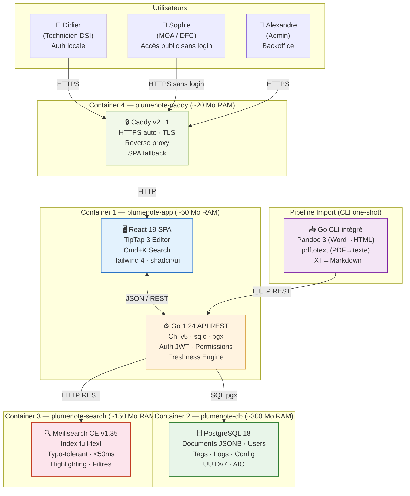
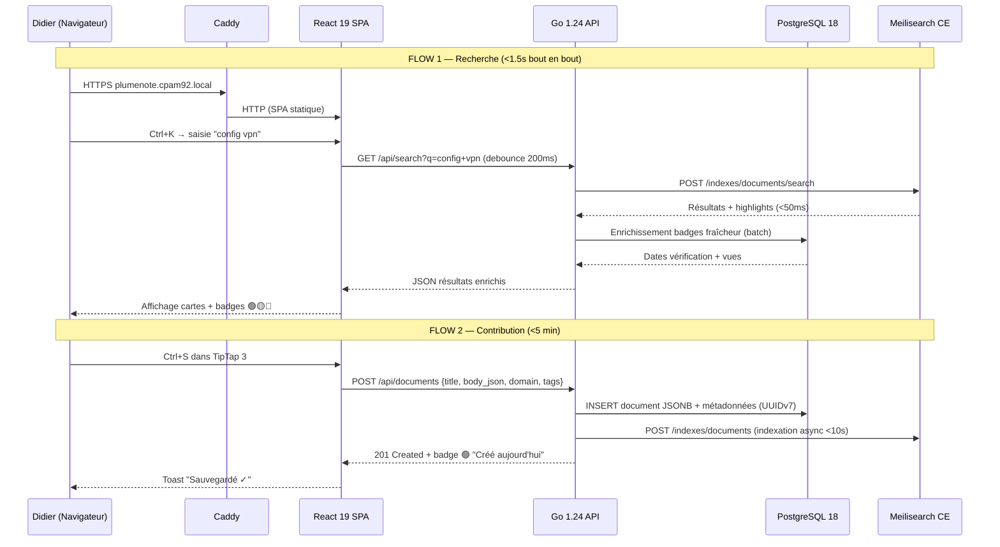
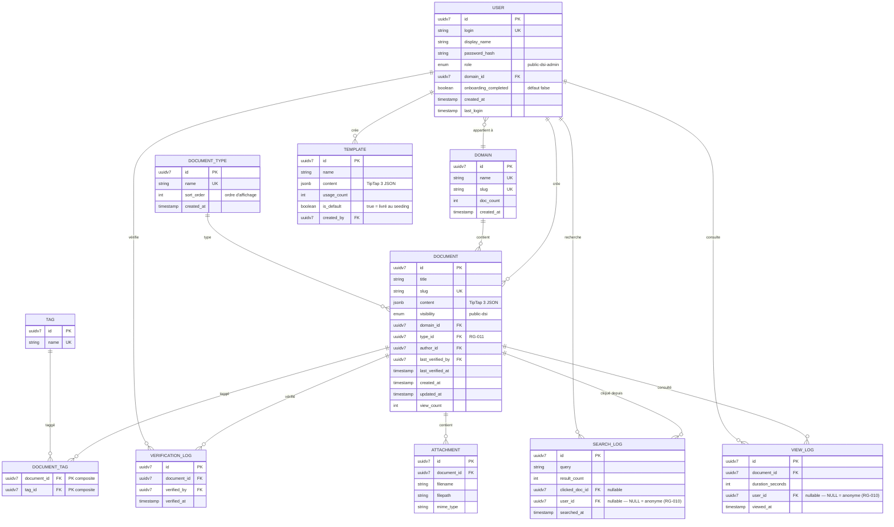

━━━━━━━━━━━━━━━━━━━━━━━━━━━━━━━━━━━━━━━━━━━━━━━
🏗️ BLUEPRINT TECHNIQUE — PlumeNote
Complexité estimée : Moyenne-Haute Basé sur : P0 (Cadrage) · P3.4 (Concept) · P4.1 (Backlog 48 US — v3.0)
Audit état de l'art : Mars 2026 (10 couches vérifiées) Gate Review P4.3 : Corrections intégrées (anomalies #2, #3, #9, #10)
━━━━━━━━━━━━━━━━━━━━━━━━━━━━━━━━━━━━━━━━━━━━━━━

---

## 1. Diagramme d'Architecture (C4 Level 2 — Container)



**Vue ASCII (Fallback)** :

```text
    ┌─────────────┐  ┌─────────────┐  ┌─────────────┐
    │   Didier     │  │   Sophie     │  │  Alexandre   │
    │  (DSI Auth)  │  │  (Public)    │  │   (Admin)    │
    └──────┬───────┘  └──────┬───────┘  └──────┬───────┘
           │                 │                 │
           └────────────┐    │    ┌────────────┘
                        ▼    ▼    ▼
                ┌──────────────────────┐
                │  Caddy v2.11         │ ◀── HTTPS :443
                │  TLS · Reverse Proxy │
                └──────────┬───────────┘
                           │ HTTP :8080
                ┌──────────▼───────────┐
                │  CONTAINER 1         │
                │  plumenote-app       │
                │ ┌──────────────────┐ │
                │ │ React 19 SPA     │ │
                │ │ TipTap 3 · Cmd+K │ │
                │ └────────┬─────────┘ │
                │          │ JSON/REST  │
                │ ┌────────▼─────────┐ │
                │ │ Go 1.24 Backend  │ │
                │ │ Chi · sqlc · pgx │ │
                │ │ Auth · Freshness │ │
                │ └──┬───────────┬───┘ │
                └────┼───────────┼─────┘
                     │ SQL       │ HTTP
             ┌───────▼───┐ ┌────▼─────────┐
             │CONTAINER 2 │ │ CONTAINER 3  │
             │PostgreSQL  │ │ Meilisearch  │
             │18 (JSONB)  │ │ CE v1.35     │
             └────────────┘ └──────────────┘

    ┌──────────────┐
    │ Pipeline CLI │──── HTTP/REST ───▶ Go Backend
    │ Pandoc 3     │     (import batch one-shot)
    └──────────────┘
```

**Flux de données critiques** :



---

## 2. Stack Technique (La "Tech Stack")

|Couche|Techno Choisie|Version Mars 2026|Pourquoi ce choix ? (Justification P0/P4.1 + Audit)|
|---|---|---|---|
|**Frontend**|React + TipTap|**React 19.2** · **TipTap 3.x**|React 19 stable (déc. 2024, 48% d'adoption). TipTap 3 apporte le composant déclaratif `<Tiptap />`, SSR, JSX natif et TableKit consolidé. Écosystème éditeur le plus large (slash commands, code blocks, tables, liens internes). Svelte/Solid exclus : écosystème éditeur trop pauvre pour 13 US éditeur (EPIC-04).|
|**Build Frontend**|Vite|**7.x**|Standard de facto (31M npm/sem). Plugin `@tailwindcss/vite` natif. Turbopack/Rspack exclus : pas de gain pertinent hors Next.js.|
|**UI / CSS**|Tailwind CSS + shadcn/ui|**Tailwind 4.x**|V4 stable (jan. 2025). Moteur Oxide Rust : builds 5×, rebuilds 100× plus rapides. Config CSS-first (`@theme`). shadcn/ui pour modale Cmd+K, dropdowns, formulaires admin.|
|**Coloration syntaxique**|Shiki (via TipTap)|**1.x**|Server-grade pour bash, PowerShell, SQL, Python, JSON, XML (US-303/405). Supporté nativement par TipTap 3.|
|**Backend**|Go|**1.24+**|Binary ~15 Mo, idle ~15 Mo RAM. Swiss Tables (perf +2-3%). Rust exclu : compile 5-20× plus lent, gain invisible à 50 users. Bun/Node exclus : runtime ~100 Mo, idle 30-80 Mo (P0 : <2 Go total).|
|**Framework HTTP**|go-chi|**v5.2**|18.6k ⭐. 100% net/http compatible. Middleware grouping + subrouter mounting (absent stdlib Go 1.22+). Fiber exclu : pas net/http compatible.|
|**SQL / ORM**|sqlc + pgx|**sqlc 1.27+** · **pgx 5.7+**|sqlc : code Go type-safe depuis SQL brut, erreurs compilation, zéro reflection. pgx : driver PG le plus performant (protocole binaire, statement cache). GORM exclu : reflection runtime.|
|**Database**|PostgreSQL|**18.3**|Sorti sept. 2025, stable (3 minor releases). AIO : jusqu'à 3× perf reads. UUIDv7 natif. SQL/JSON standard. Prépare Apache AGE (graphe V1.0).|
|**Recherche**|Meilisearch CE|**v1.35 (MIT)**|<50ms, typo-tolerance native, highlighting, filtres faceted, français out-of-the-box. ~150 Mo RAM pour 500 docs. ParadeDB pg_search : prometteur mais pré-v1.0 — à surveiller V2.0.|
|**Auth (MVP)**|bcrypt + JWT|bcrypt cost 12 · HS256|Comptes locaux par admin (RG-005). Keycloak exclu : +512 Mo RAM pour 20 comptes. LDAP V2 via interface `Authenticator`.|
|**Import**|Pandoc + Go CLI|**Pandoc 3.x**|Sous-commande `plumenote import`. .docx→HTML→TipTap JSON. PDF→texte. TXT→Markdown. Convention dossiers pour domaines (RG-009).|
|**Storage fichiers**|Filesystem local|—|`/data/uploads/`. Suffisant pour 50 users, ~500 docs. Backup rsync.|
|**Reverse Proxy**|Caddy|**v2.11**|HTTPS auto, 10 lignes config, SPA fallback, ~20 Mo RAM. Nginx exclu : config manuelle. Traefik exclu : overkill pour 1 app.|
|**Infra / Hosting**|Docker Compose|**v2.x**|4 containers. Self-hosted VM interne CPAM92. `docker compose up -d`. Pas de Kubernetes.|
|**CI/CD**|Makefile + Docker Build|—|`make build` → binary Go + bundle React. `make deploy` → docker compose up.|

**RAM totale estimée : ~520 Mo** (app ~50 + PG18 ~300 + Meili ~150 + Caddy ~20). Marge >1.4 Go sous le plafond de 2 Go.

---

## 3. Architecture Decision Records (ADR)

### ADR-001 : Choix de l'architecture — Monolithe Modulaire

- **Contexte** : Projet MVP, 1 développeur principal (Alexandre + Claude), 50 utilisateurs, self-hosted 1 VM.
- **Options** : (A) Microservices Go · (B) Monolithe modulaire Go · (C) Serverless (exclu : self-hosted P0).
- **Décision** : **(B) Monolithe modulaire**. Un binary Go ~15 Mo contenant API REST, moteur fraîcheur, import, serveur SPA (`embed`). Packages : `/internal/auth`, `/internal/document`, `/internal/search`, `/internal/freshness`, `/internal/importer`, `/internal/analytics`.
- **Conséquences** : 1 binary à déployer/debugger. Pas de réseau inter-services. Refactoring microservices possible si >500 users. ⚠️ Discipline interfaces entre packages.

### ADR-002 : Stratégie d'Authentification — Auth locale bcrypt + JWT

- **Contexte** : Self-hosted (P0). Accès postes lambda. ~20 comptes DSI.
- **Options** : (A) Keycloak · (B) Auth locale bcrypt/JWT · (C) LDAP direct.
- **Décision** : **(B) bcrypt cost 12 + JWT HS256**. Comptes créés par admin dans backoffice (US-804).
- **Raison** : Keycloak = +1 container, +512 Mo RAM pour 20 comptes. LDAP = intégration AD non spécifiée. Auth locale = pont fiable vers LDAP V2 (même table `users`, ajout provider via interface `Authenticator`).
- **Conséquences** : ✅ Zéro dépendance externe. ⚠️ Pas de SSO. 📅 LDAP/OIDC V2.

### ADR-003 : Moteur de recherche — Meilisearch CE

- **Contexte** : Full-text <1.5s, tolérance typos (US-103), highlighting (US-104), ~500 docs.
- **Options** : (A) PostgreSQL FTS · (B) Elasticsearch · (C) Meilisearch CE · (D) ParadeDB pg_search.
- **Décision** : **(C) Meilisearch CE v1.35 (MIT)**.
- **Raison** : PG FTS : pas de typo-tolerance native (deal-breaker US-103). Elasticsearch : 1 Go+ RAM. ParadeDB : prometteur mais pré-v1.0/AGPL. Meilisearch : ~150 Mo RAM, <50ms, tout natif.
- **Conséquences** : ✅ US-103/104/107 couverts. ⚠️ Pas de search sémantique (V2.0). 📡 Surveiller ParadeDB.

### ADR-004 : Stockage contenu — JSONB PostgreSQL 18

- **Contexte** : TipTap 3 produit un arbre JSON ProseMirror.
- **Options** : (A) Markdown TEXT · (B) HTML TEXT · (C) JSONB.
- **Décision** : **(C) JSONB PostgreSQL 18**. PKs UUIDv7 natif (PG18).
- **Raison** : Zéro conversion save/load. JSONB indexable et requêtable SQL/JSON. Extraction texte pour Meilisearch via traversée arbre.
- **Conséquences** : ✅ Round-trip parfait. ⚠️ ~1.5× taille vs Markdown — non significatif pour 500 docs.

### ADR-005 : Pas de CRDT / collaboration temps réel au MVP

- **Contexte** : 50 users, probabilité d'édition simultanée quasi nulle (P3.4 OUT SCOPE).
- **Décision** : Pas de Yjs/CRDT. Verrouillage optimiste last-write-wins + avertissement.
- **Conséquences** : ✅ -40% complexité (pas de WebSocket). 📅 Yjs V1.0 si besoin prouvé.

### ADR-006 : Reverse Proxy — Caddy v2.11

- **Contexte** : HTTPS sur `plumenote.cpam92.local`, certificats internes.
- **Décision** : **Caddy v2.11**. Config 10 lignes. TLS auto/certs internes. SPA fallback.
- **Raison** : nginx = config TLS manuelle, verbeux. Caddy = HTTPS natif, HTTP/3, ~20 Mo.

### ADR-007 : PostgreSQL 18 (pas 16 ni 17)

- **Contexte** : P0 mentionnait PG16. Audit mars 2026 : PG18 sorti sept. 2025, 3 minor releases, stable.
- **Décision** : **PostgreSQL 18.3**.
- **Raison** : AIO = jusqu'à 3× perf lectures (workload KM). UUIDv7 natif = PKs ordonnées temporellement (meilleur indexage B-tree). SQL/JSON (hérité PG17) pour JSONB TipTap. OAuth2 natif (prépare V2).
- **Conséquences** : ✅ Perf + DX améliorées sans coût. Image `postgres:18-alpine` disponible.

---

## 4. Requirements Non-Fonctionnels (NFR)

### 🚀 Performance (SLA)

|Métrique|Cible|Mesure|Justification|
|---|---|---|---|
|**Temps de réponse API (search)**|< **200ms** (p95)|Meili <50ms + enrichissement Go|RG-002 : affiché <1.5s côté user|
|**Temps de réponse API (CRUD)**|< **100ms** (p95)|PG18 AIO + pgx|Ctrl+S = feedback instantané (US-412)|
|**Time to Interactive (Front)**|< **2s** réseau local|Vite 7 + code splitting + Tailwind 4 Oxide|P0 : réactivité sub-100ms|
|**Indexation post-save**|< **10s**|Goroutine async → Meilisearch|RG-001 : document trouvable <10s|
|**Ouverture modale Cmd+K**|< **50ms**|React state local, zéro appel API|P0 : keyboard-first Linear|
|**Debounce as-you-type**|**200ms**|Frontend|RG-002 : éviter surcharge Meili|

### 🔒 Sécurité & Data

|Domaine|Exigence|Implémentation|
|---|---|---|
|**Auth**|**bcrypt + JWT HS256**|`golang.org/x/crypto/bcrypt` cost 12. Secret JWT en var env. Expiration configurable (défaut 24h).|
|**Chiffrement transit**|**TLS 1.2+**|Caddy v2.11. Certs internes CPAM92 ou auto-signés.|
|**Chiffrement repos**|**AES-256 disque VM**|Volume PG sur disque chiffré (responsabilité Infra).|
|**Mots de passe**|Min 8 car., hashés bcrypt|Validation API. Jamais en clair. Reset par admin (US-804).|
|**Permissions**|3 niveaux Public/DSI/Admin|Middleware Go vérifie JWT + rôle. Vue publique = filtre auto `visibility='public'` (RG-006).|
|**Injection SQL**|Requêtes paramétrées|sqlc type-safe. Zéro concaténation SQL.|
|**XSS**|Sanitization TipTap|Contenu = arbre JSON (pas HTML brut). Champs texte échappés.|
|**CSRF**|Token sur mutations|Double-submit cookie ou header `X-CSRF-Token`.|
|**RGPD**|PII minimales|Nom + login + domaine. Pas d'email. Logs publics anonymisés (RG-010).|
|**Backup**|**RPO < 24h**|`pg_dump` quotidien cron. Rsync `/data/uploads/`. Rétention 30j.|

### 📈 Scalabilité (Dimensionnement)

|Métrique|Cible MVP|Horizon V1.0|Stratégie|
|---|---|---|---|
|**Users simultanés**|**30**|50|Go 10k+ connexions. Non dimensionnant.|
|**Documents indexés**|**500**|2 000|Meilisearch conçu pour millions. Non dimensionnant.|
|**Taille base PG**|< **500 Mo**|< 2 Go|~25 Mo contenu + images.|
|**RAM totale**|**< 600 Mo**|< 1 Go|Go ~50 + PG18 ~300 + Meili ~150 + Caddy ~20.|
|**Scale**|**Vertical**|Vertical|1 VM 4 Go / 2 vCPU. Pas de cluster.|

---

## 5. Modèle de Données Simplifié (Entités Clés)



**Relations clés** :

- `User` (1) ──── (N) `Document` : un utilisateur crée N documents.
- `Domain` (1) ──── (N) `Document` : 1 document = 1 domaine.
- `Document_Type` (1) ──── (N) `Document` : 1 document = 1 type obligatoire (RG-011). Filtrable dans Meilisearch (`filterableAttributes`).
- `Document` (N) ──── (N) `Tag` : many-to-many via `Document_Tag` (PK composite `document_id` + `tag_id`, index sur `tag_id` pour lookup inverse).
- `Document` (1) ──── (N) `Verification_Log` : historique complet des vérifications de fraîcheur (Secret Sauce).
- `User` (1) ──── (1) `Domain` : domaine principal = droits d'écriture (RG-003).
- `Search_Log` / `View_Log` : `user_id` nullable — `NULL` = consultation publique anonyme (RG-010). `searched_at` / `viewed_at` = timestamp de l'événement (requis US-902/903).

**Note PG18** : toutes les PKs utilisent `uuidv7()` natif — ordonnées temporellement, meilleur indexage B-tree que UUIDv4.

---

## 6. Risques Techniques & Dettes

|#|Risque|Probabilité|Impact|Mitigation (Plan B)|
|---|---|---|---|---|
|R1|**Assemblage Go 1.24 + TipTap 3 + Meilisearch + PG18 non validé**|Moyen|**Critique**|Spike S+1-2 (P3.4 Risque #1). Prototype : 1 page TipTap 3, stockée PG18, indexée Meili, retrouvée Cmd+K <3s. Si échec → fork Docmost.|
|R2|**Conversion Pandoc Word → TipTap 3 JSON imparfaite**|Fort|Moyen|Conversion "80/20" : titres, listes, tableaux OK. Formatage Word avancé perdu. Test 10 docs réels en spike.|
|R3|**PDF nationaux avec caractères spéciaux**|Moyen|Moyen|pdftotext brut. Si OCR nécessaire → hors scope MVP, placeholder (US-702).|
|R4|**TipTap 3 breaking changes vs TipTap 2**|Moyen|Moyen|TipTap 3 GA depuis mid-2025. Extensions StarterKit/Table/CodeBlock portées. Tester slash commands en spike.|
|R5|**Conflit édition simultanée (pas de CRDT)**|Bas|Moyen|Last-write-wins + avertissement. 50 users / 500 docs = quasi nul. CRDT Yjs V1.0 si prouvé.|
|R6|**Bus factor Alexandre = 1**|Moyen|Fort|Code Go idiomatique + sqlc lisible. Lilian → frontend React. Mathieu → backend Go.|
|R7|**Migration LDAP V2 casse auth locale**|Bas|Moyen|Interface `Authenticator` (strategy). LDAP = nouveau provider. Table `users` = fallback.|
|R8|**Meilisearch CE vs Enterprise**|Bas|Bas|Split CE/Enterprise clair depuis v1.19. Toutes features PlumeNote dans CE MIT.|

**Dettes techniques acceptées (MVP)** :

|Dette|Raison de l'acceptation|Remboursement prévu|
|---|---|---|
|Pas de tests E2E|1 dev, 48 US, tests manuels suffisants|V1.0 — Playwright flows critiques|
|Pas de monitoring/alerting|50 users, `docker logs` suffit|V1.0 — Prometheus/Grafana si nécessaire|
|Pas de rate limiting API|Réseau interne CPAM92 uniquement|V1.0 si ouverture réseau|
|Logs analytics SQL brut (pas de dashboard)|RG-010 : requêtables SQL par admin|V1.0 — dashboard santé doc (P3.4 Jalon 2)|
|Pas de pagination serveur|500 docs max, 50/domaine max|V1.0 à 2000+ docs — cursor-based|

### 🌱 Stratégie de Seeding (Données Initiales)

Au premier lancement (`docker compose up` sur une base vierge), PlumeNote doit être fonctionnel immédiatement avec les données de référence. Le mécanisme choisi est la **migration SQL initiale** (fichier `migrations/001_seed.sql` exécuté une seule fois, détection via table `schema_migrations`).

**Données seedées :**

|Entité|Contenu|Détection "déjà seedé"|
|---|---|---|
|`DOCUMENT_TYPE`|10 types par défaut (RG-011) : Procédure technique, Guide utilisateur, Architecture système, FAQ, Troubleshooting, Fiche applicative, Procédure d'installation, Note de version, Guide réseau, Documentation d'API + 1 type "Autre"|`SELECT count(*) FROM document_type` > 0|
|`TEMPLATE`|10 templates par défaut (RG-008 / T-01 à T-10) avec `is_default = true`, contenu TipTap JSON embarqué dans le fichier de migration|`SELECT count(*) FROM template WHERE is_default = true` > 0|
|`DOMAIN`|4 domaines initiaux : SCI, Études & Dev, Infrastructure, Support|`SELECT count(*) FROM domain` > 0|
|`USER`|1 compte admin initial (login `admin`, mot de passe temporaire affiché en console au premier lancement, `onboarding_completed = false`)|`SELECT count(*) FROM "user" WHERE role = 'admin'` > 0|

**Implémentation Go** : Le binary Go exécute les migrations au démarrage (`internal/migrate`). Les fichiers SQL sont embarqués via `embed.FS`. Pas de dépendance externe (pas de golang-migrate ni goose — le mécanisme est trivial pour un monolithe).

---

━━━━━━━━━━━━━━━━━━━━━━━━━━━━━━━━━━━━━━━━━━━━━━━

_Livrable : P4.2-Blueprint.md — Projet PlumeNote — Version 3.0 (post-Gate Review P4.3) — Mars 2026_ _Modifications v3.0 : +DOCUMENT_TYPE (RG-011), +DOCUMENT_TAG (jointure), SEARCH_LOG/VIEW_LOG complétés (timestamp + user_id), USER.onboarding_completed, TEMPLATE.is_default, stratégie de seeding, 48 US._ _Prochaine étape : Spike Technique (S+1-2) — Validation assemblage Go 1.24 + TipTap 3 + Meilisearch CE + PostgreSQL 18_

━━━━━━━━━━━━━━━━━━━━━━━━━━━━━━━━━━━━━━━━━━━━━━━