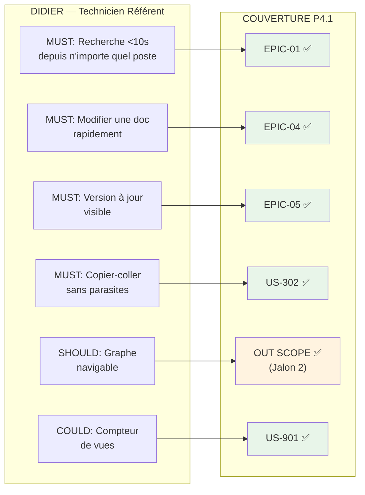

━━━━━━━━━━━━━━━━━━━━━━━━━━━━━━━━━━━━━━━━━━━━━━━ 🛡️ RAPPORT D'AUDIT AVANT DÉVELOPPEMENT — PlumeNote État du dossier : 🟡 GO CONDITIONNEL (12/13 anomalies corrigées — bloquant résiduel : tests P2.2 non exécutés) Auditeur : Lead QA — Phase P4.3 Gate Review Documents audités : P0, P1.1, P1.2, P1.3, P1.4, P2.1, P2.2, P2.3, P3.1, P3.2, P3.3, P3.4, P4.1, P4.2 Date initiale : Mars 2026 · Mise à jour post-corrections : Mars 2026 ━━━━━━━━━━━━━━━━━━━━━━━━━━━━━━━━━━━━━━━━━━━━━━━

---

## 1. Audit de Qualité des Specs (P4.1 & P4.2)

### Qualité des User Stories (Critères INVEST & BDD)

- **Clarté & Testabilité** : **4/5** — Le Gherkin est bien utilisé. Les 48 US suivent toutes le format "En tant que / Je veux / Afin de" avec des critères GIVEN/WHEN/THEN exploitables. Les scénarios sont suffisamment précis pour écrire des tests automatisés. Les liens maquettes (P3.4) sont systématiquement référencés. Seul bémol : les Règles Métier liées sont parfois absentes (champ "—" sur ~15 US), ce qui laisse le développeur deviner les contraintes transversales applicables.
    
- **Complétude des Cas d'Erreur** : **3/5** — Les "Happy Paths" sont couverts avec soin. Les Unhappy Paths sont présents sur les US critiques (identifiants incorrects US-201, fichier corrompu US-701, PDF scanné US-702, lien cassé US-306, droits insuffisants US-413). **Mais** plusieurs US manquent de scénarios d'erreur évidents (voir anomalies #1 à #4 ci-dessous). Un développeur confronté à un cas non spécifié inventera un comportement — c'est la définition d'une spec ambiguë.
    

### Anomalies Détectées (Issues Log)

|ID|Document|Problème (Ambiguïté/Manque)|Sévérité|Action Requise|Résolution|
|---|---|---|---|---|---|
|**#1**|P4.1 — Backlog complet|**Pas de User Story pour la suppression d'un document.** Le CRUD est incomplet : on peut Créer (US-401), Lire (US-301), Modifier (US-413)… mais pas Supprimer. Si Didier publie un document par erreur, ou si une procédure est définitivement obsolète, il n'a aucun moyen de l'enlever. C'est un trou fonctionnel fondamental.|🔴 Bloquant|Ajouter une US "Supprimer / Archiver un document" avec critères : confirmation, impact sur l'index Meilisearch, impact sur les liens internes pointant vers ce document (US-306 scénario lien cassé), droits requis.|✅ **Corrigé** — US-414 ajoutée (P4.1 v3.0). 6 scénarios BDD couvrant confirmation, droits, liens cassés, logs, admin.|
|**#2**|P4.2 — Modèle de données (SEARCH_LOG, VIEW_LOG)|**Champs manquants dans le modèle.** US-902 exige : `terme, timestamp, nb résultats, ID résultat cliqué, identifiant utilisateur`. US-903 exige : `ID document, timestamp, durée, identifiant utilisateur`. Or le modèle P4.2 omet `timestamp` et `user_id` sur `SEARCH_LOG`, et `timestamp` et `user_id` sur `VIEW_LOG`. Le développeur ne peut pas implémenter les US telles que spécifiées sans deviner le schéma. De plus, RG-010 dit "Logs vue publique anonymisés (pas d'identifiant utilisateur)" — ce qui nécessite un `user_id` nullable, non un champ absent.|🔴 Bloquant|Compléter le modèle : ajouter `timestamp`, `user_id` (nullable) sur les deux entités. Ajouter un champ `is_anonymous` ou expliciter la convention NULL = anonyme.|✅ **Corrigé** — `searched_at`, `viewed_at`, `user_id` nullable ajoutés (P4.2 v3.0). Convention NULL = anonyme documentée.|
|**#3**|P4.1 US-107 vs P4.2 Data Model|**Le filtre "par type" n'a pas de support data.** US-107 dit "filtrer les résultats de recherche par domaine **et par type de document**". Or l'entité `DOCUMENT` dans P4.2 n'a pas de champ `type`. Aucune taxonomie de types n'est définie (procédure, guide, FAQ, architecture…). Les templates (T-01 à T-10) pourraient servir de proxy, mais aucune relation `template_id` n'est stockée sur le document après création. Le développeur ne peut pas implémenter ce filtre.|🔴 Bloquant|Soit ajouter un champ `type` (enum ou FK vers une table `document_type`), soit retirer "par type" de US-107 et ne garder que le filtre par domaine.|✅ **Corrigé** — Décision sponsor : ajouter un champ `type`. Entité `DOCUMENT_TYPE` ajoutée (P4.2 v3.0), FK `type_id` sur `DOCUMENT`, RG-011 créée (P4.1 v3.0), US-107 et US-401 mises à jour.|
|**#4**|P2.2/P2.3 vs P4.1/P4.2|**Les 3 tests pré-requis (spike technique, démo interne, concierge MVP) n'ont pas de statut documenté.** P2.3 émet un "GO CONDITIONNEL" explicitement conditionné à l'exécution de 3 tests (semaines 1-5). P4.1 et P4.2 rédigent des specs comme si le GO était acquis. Aucun document ne confirme que les tests ont été exécutés ou passés. C'est un pré-requis de gouvernance non levé.|🔴 Bloquant|Documenter le résultat des 3 tests P2.2. Si non exécutés → les exécuter AVANT de lancer le développement. Le backlog reste en suspens tant que la Gate Review P2.3 n'est pas formellement clôturée.|⚠️ **Documenté, NON LEVÉ** — P2.3 mis à jour (v1.1) avec tableau de résultats : 0/3 tests exécutés. Le GO CONDITIONNEL est maintenu. Les tests doivent être exécutés AVANT le développement.|
|**#5**|P3.4 §4 vs P4.2 §1|**Nombre de containers Docker incohérent.** P3.4 annonce "Docker cible Jalon 1 : **3 containers**". P4.2 définit **4 containers** en ajoutant `plumenote-caddy`.|🟡 Majeur|Mettre à jour P3.4 pour refléter 4 containers.|✅ **Corrigé** — P3.4 v1.2 : 4 containers, Caddy ajouté, RAM ~520 Mo.|
|**#6**|P3.4 Flow Onboarding vs P4.1 EPIC-02|**Incohérence auth LDAP vs auth locale.** Le Flow Onboarding de P3.4 décrit explicitement "Authentification LDAP (SSO transparent)". Or P4.1 (US-201) et P4.2 (ADR-002) implémentent une auth locale login/mot de passe.|🟡 Majeur|Mettre à jour le Flow Onboarding P3.4 pour refléter l'auth locale V1.|✅ **Corrigé** — P3.4 v1.2 : Flow Onboarding, diagramme architecture, description MVP et stack tous alignés sur auth locale. LDAP marqué V2 partout.|
|**#7**|P4.1 — Backlog complet|**Pas de US pour la déconnexion.** Le wireframe P3.4 montre "déconnexion" dans le menu avatar. Aucune US ne couvre le logout.|🟡 Majeur|Ajouter US-205 "Se déconnecter".|✅ **Corrigé** — US-205 ajoutée (P4.1 v3.0). 3 scénarios BDD : nominal, expiration session, accès public post-déconnexion.|
|**#8**|P4.1 — Backlog complet|**Pas de US pour le changement de mot de passe par l'utilisateur.** Seul le reset admin existe (US-804).|🟡 Majeur|Ajouter US-206 "Changer mon mot de passe".|✅ **Corrigé** — US-206 ajoutée (P4.1 v3.0). 4 scénarios BDD : nominal, MDP actuel incorrect, confirmation mismatch, MDP trop court.|
|**#9**|P4.2 — Modèle de données|**Table de jointure DOCUMENT ↔ TAG absente du modèle.** Le diagramme ER montre une relation many-to-many mais aucune entité `DOCUMENT_TAG` n'est modélisée.|🟡 Majeur|Ajouter l'entité `DOCUMENT_TAG`.|✅ **Corrigé** — `DOCUMENT_TAG` ajoutée (P4.2 v3.0) avec PK composite `document_id` + `tag_id`.|
|**#10**|P4.2 — Blueprint|**Pas de stratégie de seeding des 10 templates par défaut.** RG-008 et US-801 exigent que PlumeNote démarre avec 10 templates. P4.2 ne précise pas le mécanisme.|🟡 Majeur|Spécifier le mécanisme de seeding.|✅ **Corrigé** — Section "Stratégie de Seeding" ajoutée (P4.2 v3.0). Migration SQL initiale via `embed.FS` Go. 4 entités seedées : types, templates, domaines, admin.|
|**#11**|P4.1 US-901|**Le compteur de vues ne gère pas les consultations multiples du même utilisateur.** Si Didier ouvre 10 fois le même document, le compteur passe de 47 à 57.|🟠 Mineur|Ajouter un scénario de dé-duplication OU accepter le biais.|⏸️ **Accepté en l'état** — Biais documenté. Dé-duplication = over-engineering pour le MVP. Réévaluation V1.0.|
|**#12**|P4.1 US-203|**Le hint "Essayez Ctrl+K" stocké en localStorage ne fonctionnera pas cross-poste.**|🟠 Mineur|Stocker le flag côté serveur.|✅ **Corrigé** — Champ `onboarding_completed` ajouté sur `USER` (P4.2 v3.0).|
|**#13**|P3.4 §8 Points restants #2|**La granularité des permissions n'est pas tranchée.** P3.4 pose la question mais P4.1/P4.2 implémentent déjà le 3 niveaux.|🟠 Mineur|Fermer formellement le point.|✅ **Fermé** — Le modèle 3 niveaux (Public/DSI/Admin) est validé pour le MVP par l'implémentation P4.1/P4.2. Point clos.|

---

## 2. Matrice de Traçabilité & Cohérence

### 📉 Couverture des Besoins (Y a-t-il des trous ?)

**Besoins P1.3 → P4.1 :**

- **Besoins P1.3 non couverts** : **Aucun** — Tous les Must Have de Didier, Alexandre et Sophie sont tracés vers au moins une US. Les Should Have et Could Have sont correctement différés (Jalon 2/3).

**Objectifs P2.1 → P4.1 :**

|Objectif P2.1|KPI|Couverture P4.1|Statut|
|---|---|---|---|
|North Star (Search-to-View Rate)|Recherches → consultations/semaine|US-902 + US-903 (logs)|✅ Couvert|
|Adoption DSI ≥60% MAU|% collaborateurs actifs|US-902 (user_id dans logs)|⚠️ Couvert SI anomalie #2 corrigée (user_id manquant)|
|Réduction tickets -30%|Tickets MOA question couverte|US-204 (CTA fallback) + analytics|⚠️ Proxy indirect — mesure hors PlumeNote (GLPI)|
|Couverture 80% procédures|% procédures critiques formalisées|EPIC-07 (import) + EPIC-04 (contribution)|✅ Mécanisme en place|

- **Objectifs P2.1 non adressés** : **Aucun** en termes de mécanismes. La métrique "Réduction tickets -30%" dépend d'une mesure dans GLPI qui est hors périmètre PlumeNote — c'est un risque de mesurabilité, pas un trou fonctionnel.

### 🐷 Détection de "Gold Plating" (Y a-t-il du gras ?)

|Feature P4.1|Besoin P1.3 rattaché|Verdict|
|---|---|---|
|US-307 Prévisualisation|Aucun besoin P1.3 explicite|🟡 **Discutable.** Utile mais pas demandé. Le coût est faible (TipTap a un mode read-only natif). **Conserver.**|
|US-408 Blocs alerte/astuce|Aucun besoin P1.3 explicite|✅ Justifié — améliore la lisibilité des procédures critiques (alertes Danger).|
|T-10 Template "Documentation d'API"|Aucun besoin P1.3|🟡 **Discutable.** La DSI d'une CPAM documente-t-elle des APIs ? Le template est un coût quasi nul (contenu statique), mais il peut créer de la confusion. **Conserver mais vérifier pertinence.**|
|US-805 Config URL GLPI|Besoin Sophie (fallback)|✅ Justifié — 1 US simple, impact direct sur le KPI réduction tickets.|

**Verdict Gold Plating** : Le backlog est **remarquablement lean**. Aucune feature "gras" identifiée. La discipline de scope entre P2.3 (OUT SCOPE) et P4.1 est exemplaire. Les seuls items discutables (US-307, T-10) ont un coût marginal.

### 🏗️ Cohérence Tech vs Métier

**Adéquation Stack / Besoin :**

|KPI P2.1|Exigence technique|Couverture P4.2|Verdict|
|---|---|---|---|
|Recherche <10 secondes (cible <3s)|Full-text, typo-tolerant, highlighting|Meilisearch CE v1.35 (<50ms)|✅ Sur-dimensionné positivement|
|Accès universel (intervention agent)|Web, HTTPS, sans VPN fichier|Go binary + Caddy TLS + mode public|✅ Couvert|
|Fraîcheur visible|Badge calculé sur date de vérification|Freshness Engine Go + champ `last_verified_at`|✅ Couvert|
|Coût contribution <5 min|Éditeur rapide, templates, indexation auto|TipTap 3 + Meilisearch async <10s|✅ Couvert|
|Uptime ≥99,5%|Self-hosted, résilience|Docker Compose + pg_dump quotidien (RPO <24h)|⚠️ **Pas de RTO défini.** Combien de temps pour restaurer ? Pas de health check Docker.|
|Admin <2h/mois|Simplicité opérationnelle|4 containers Docker, Makefile, pas de K8s|✅ Cohérent|
|RAM <2 Go|Contrainte P0|520 Mo estimé (marge 1,4 Go)|✅ Largement dans la cible|

**Respect des Contraintes P0 :**

|Contrainte P0|Implémentation P4.2|Verdict|
|---|---|---|
|Self-hosted obligatoire|Docker Compose, 4 containers, VM interne|✅|
|Aucune donnée hors infrastructure|Toutes les données en PostgreSQL local + filesystem local|✅|
|Formats hétérogènes (Word/PDF/TXT)|Pipeline Pandoc + pdftotext + interprétation Markdown|✅|
|Accès poste lambda sans admin|Application web HTTPS, auth propre + mode public|✅|

---

## 3. Checklist de Lancement (Definition of Ready)

- [x] Le périmètre MVP est clair et isolé (P3.4 §5 / P4.1 §4) — 48 US MUST HAVE, exclusions explicites avec jalons cibles.
- [x] **Les maquettes correspondent aux Stories** — ✅ Incohérence Flow Onboarding LDAP corrigée (P3.4 v1.2). Les 5 vues sont cohérentes avec P4.1.
- [x] **Les choix techniques sont validés (ADR signés)** — 7 ADR documentés dans P4.2 v3.0, cohérents entre eux. Modèle de données complet. Stratégie de seeding définie.
- [ ] **Les risques critiques (P2.2) sont sous contrôle** — ⚠️ Les 3 tests de mitigation (spike, démo, concierge) n'ont pas été exécutés. Documenté dans P2.3 v1.1. C'est le **seul bloquant résiduel**.

---

## 4. VERDICT FINAL

┌──────────────────────────────────────────────────────────┐ │ DÉCISION : 🟡 GO CONDITIONNEL │ │ Dossier documentaire : 🟢 SAIN (12/13 anomalies │ │ corrigées). Bloquant résiduel : exécution des 3 tests │ │ P2.2 (gouvernance, pas documentation). │ └──────────────────────────────────────────────────────────┘

### Justification

Le dossier PlumeNote est d'une qualité **exceptionnelle** pour un projet de cette taille. La chaîne causale P0 → P4.2 est traçable, cohérente, et disciplinée. Le backlog de 48 US est lean, bien structuré en Gherkin, et couvre l'intégralité des besoins Must Have de P1.3. La stack technique est justifiée, dimensionnée, et documentée avec des ADR solides. Le modèle de données est complet. La dette technique est acceptée en connaissance de cause et documentée. Il n'y a pas de Gold Plating.

**Ce qui a été corrigé suite à l'audit initial :**

|Livrable|Version|Corrections|
|---|---|---|
|P2.3|v1.0 → v1.1|Tableau résultats tests P2.2 ajouté (0/3 exécutés), critères de basculement GO franc formalisés|
|P3.4|v1.1 → v1.2|Flow Onboarding (auth locale, pas LDAP), 4 containers (pas 3), versions stack alignées P4.2|
|P4.1|v2.0 → v3.0|+US-205 (déconnexion), +US-206 (changement MDP), +US-414 (suppression document), US-107 corrigée (filtre type), +RG-011 (types document). Total : 45 → 48 US|
|P4.2|v2.0 → v3.0|+DOCUMENT_TYPE, +DOCUMENT_TAG, SEARCH_LOG/VIEW_LOG complétés, USER.onboarding_completed, TEMPLATE.is_default, stratégie de seeding|

**Synthèse des anomalies :**

|Catégorie|Initial|Post-corrections|
|---|---|---|
|🔴 Bloquants|4|**1 résiduel** (#4 — tests P2.2 non exécutés). Les 3 autres (#1, #2, #3) sont corrigés.|
|🟡 Majeurs|6|**0** — Tous corrigés (#5, #6, #7, #8, #9, #10).|
|🟠 Mineurs|3|**1 accepté** (#11 — compteur de vues sans dédupliquation). Les 2 autres (#12, #13) sont corrigés.|

**Ce qui empêche le GO franc :**

Un seul point — et ce n'est pas un problème de documentation : les **3 tests P2.2** (spike technique, démo interne, concierge MVP contenu) n'ont pas été exécutés. Ce sont des tests terrain, pas des livrables. Le dossier est prêt. L'organisation ne l'est pas encore.

### Prochaines étapes immédiates

|#|Action|Effort|Condition de sortie|
|---|---|---|---|
|1|**Exécuter le spike technique** (Test #1 P2.2) : assemblage Go + TipTap + Meilisearch + PG18, recherche <3s|2 semaines|Prototype fonctionnel OU décision pivot fork Docmost|
|2|**Exécuter la démo interne** (Test #2 P2.2) : présentation aux 4 contributeurs-clés|30 minutes|≥3/4 engagés avec documents concrets nommés|
|3|**Exécuter le concierge MVP contenu** (Test #3 P2.2) : 20 fiches de procédures critiques|4 semaines (parallèle au spike)|≥15 fiches rédigées|
|4|**Gate Review finale** : si 3/3 passent → 🟢 GO FRANC pour le Jalon 1|1 heure|Décision sponsor documentée dans P2.3|

━━━━━━━━━━━━━━━━━━━━━━━━━━━━━━━━━━━━━━━━━━━━━━━

_Livrable : P4.3-Audit-Gate-Review.md — Projet PlumeNote — Version 1.1 (post-corrections) — Mars 2026_ _Verdict : GO CONDITIONNEL — Dossier documentaire sain (12/13 corrigées). Bloquant résiduel : exécution des 3 tests P2.2._

━━━━━━━━━━━━━━━━━━━━━━━━━━━━━━━━━━━━━━━━━━━━━━━